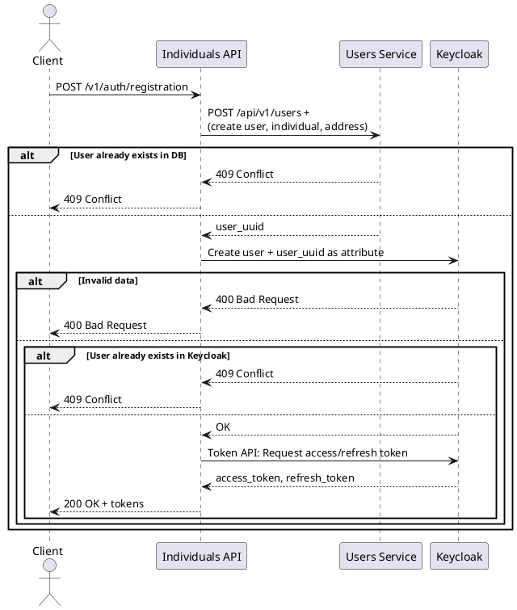
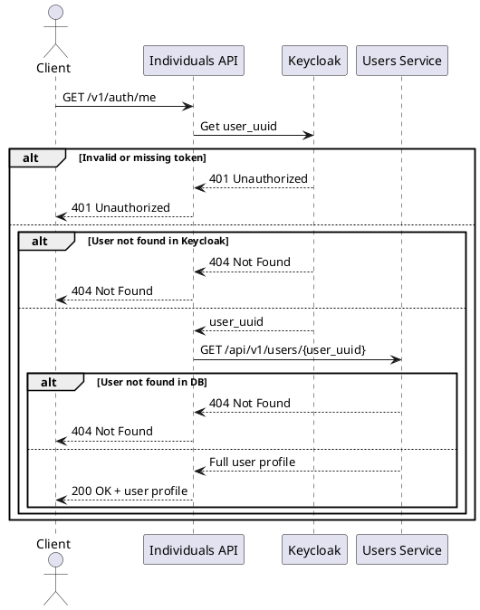
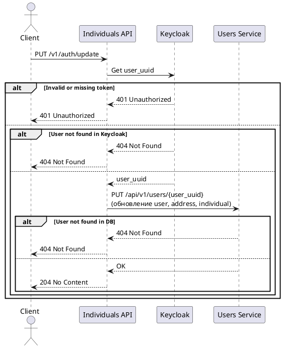
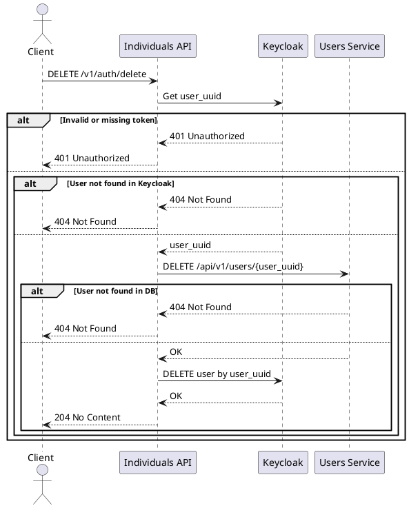

# User service

A Spring Boot-based microservice for managing users and their related entities (address, personal data) within a monorepository. The service provides a transactional CRUD interface and supports monitoring, tracing, auditing of changes, as well as auto-generation of APIs according to the OpenAPI specification.

---

## Architecture 

---

## C4 diagram

---

## Individuals Auth system

```plantuml
@startuml
!includeurl https://raw.githubusercontent.com/plantuml-stdlib/C4-PlantUML/master/C4_Container.puml

Person(dev, "External Client", "Пользователь, взаимодействующий с Individuals API")

System_Boundary(indSystem, "Individuals Auth System") {
    Container(indApi, "Individuals Api", "Spring Boot WebFlux", "Оркестратор: регистрация, логин, обновление токена, получение данных")
    Container(keycloak, "Keycloak", "Keycloak 24", "Управление пользователями, токены, роли, авторизация")
    Container(postgres, "Keycloak Postgres", "PostgreSQL", "Хранение данных пользователей Keycloak")
    Container(prometheus, "Prometheus", "Monitoring", "Сбор метрик с сервисов")
    Container(loki, "Loki", "Logging", "Сбор логов из stdout")
    Container(grafana, "Grafana", "Visualization", "Отображение логов и метрик в дэшбордах")
    Container(usersService, "User Service", "Spring Boot", "Управление пользовательскими профилями")
    Container(usersDb, "User DB", "PostgreSQL", "Хранение данных пользователей")
}

Rel(dev, indApi, "HTTP запросы (регистрация, логин, /me)", "JSON/REST")
Rel(indApi, keycloak, "REST-запросы в Keycloak Admin/Token API", "HTTP")
Rel(keycloak, postgres, "JDBC", "SQL")
Rel(indApi, prometheus, "Отправка метрик", "Micrometer")
Rel(indApi, loki, "Отправка логов", "stdout -> Docker -> Loki")
Rel(grafana, prometheus, "Чтение метрик")
Rel(grafana, loki, "Чтение логов")
Rel(indApi, usersService, "Feign/OpenAPI: CRUD профиля")
Rel(usersService, usersDb, "JPA", "SQL")
@enduml
```
---

## User profile service

```plantuml
@startuml
!includeurl https://raw.githubusercontent.com/plantuml-stdlib/C4-PlantUML/master/C4_Container.puml

Person(dev, "External Client", "Пользователь, взаимодействующий с Individuals API")

System_Boundary(userSystem, "User Profile System") {
    Container(usersService, "User Service", "Spring Boot", "Управление пользовательскими профилями")
    Container(usersDb, "User DB", "PostgreSQL", "Хранение данных пользователей")
    Container(prometheus, "Prometheus", "Monitoring", "Сбор метрик с сервисов")
    Container(loki, "Loki", "Logging", "Сбор логов из stdout")
    Container(tempo, "Tempo", "Tracing", "Сбор распределённых трейсингов")
    Container(grafana, "Grafana", "Visualization", "Отображение логов и метрик в дэшбордах")
}

Rel(dev, usersService, "HTTP запросы (регистрация, логин, /me)", "JSON/REST")
Rel(usersService, usersDb, "JPA", "SQL")
Rel(usersService, prometheus, "Отправка метрик", "Micrometer")
Rel(usersService, loki, "Отправка логов", "stdout -> Docker -> Loki")
Rel(usersService, tempo, "Отправка трейсингов", "OpenTelemetry/OTLP")
Rel(grafana, prometheus, "Чтение метрик")
Rel(grafana, loki, "Чтение логов")
Rel(grafana, tempo, "Чтение трейсингов")
@enduml
```

---

## Sequence diagrams 

---


---



---



---



---

## Tech Stack

- Java 24
- Spring Boot 3.5.0
- Gradle 8.5
- PostgreSQL, Flyway
- Spring Data JPA, Hibernate Envers
- Docker / Docker Compose
- Spring Actuator, Prometheus, Grafana

---
